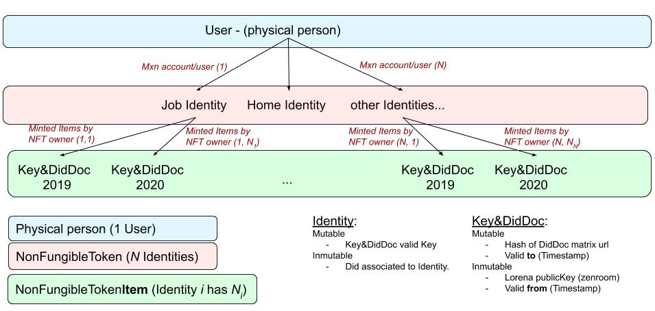

# Lorena-Maxonrow integration README

## Requirements

Blockchain usage is specified by argument.
	
### Use Lorena Blockchain

--didMethod=did:lor:lab

### Use Maxonrow Blockchain

--didMethod=did:lor:max

## Design

Infer from didMethod which Blockchain class must be instantiated

### Practical Examples
    - [Create a Token](create-token-sample.md)
    - [Create a Token Item and mint it](create-tokenItem-and_mint.md)
    - [Query a Token Item](query-tokenItem.md)

<!--stackedit_data:
eyJoaXN0b3J5IjpbMjA2MTYwMzYyOCwtMzI4Njg1NDU0LC0xMz
c3NjU4MjE4XX0=
-->