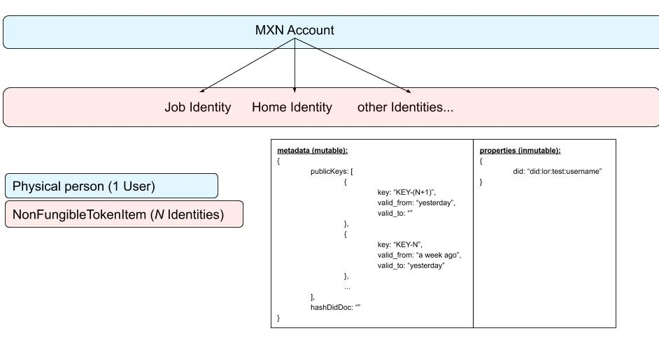

Blockchain User Requirements and High Level Design

## Requirements

Blockchain usage is specified by argument.
	
### Use Lorena Blockchain

--didMethod=did:lor:lab

### Use Maxonrow Blockchain

--didMethod=did:lor:max

### High Level Design

Infer from didMethod which Blockchain class must be instantiated

### Low Lever Design

// CAIO

// | | |

// idHme=PARENT PARENT=idJob ... = Identidad : DID

// | |

// H H H

  

// Identity = DID

// | | |

// Key Key

  

// Identity = CAIO

// NonFungibleToken - DIDs

// NonFungibleTokenItem =

  

// //* Operation 2 : Mint NFT Item to own-self

// // let nftItemMinted: NonFungibleTokenItem;

  

// let item = {

// symbol: "DID",

// itemID: 'did:example:123456#oidc',

// properties: "properties",

// metadata: "str1"

// }

  

// let minterNFT = new NonFungibleToken("DID", issuer);

  

// return minterNFT.mint(issuer.address, item).then((receipt) => {

// console.log(receipt); //do something

// });
<!--stackedit_data:
eyJoaXN0b3J5IjpbMjA2MTYwMzYyOCwtMzI4Njg1NDU0LC0xMz
c3NjU4MjE4XX0=
-->